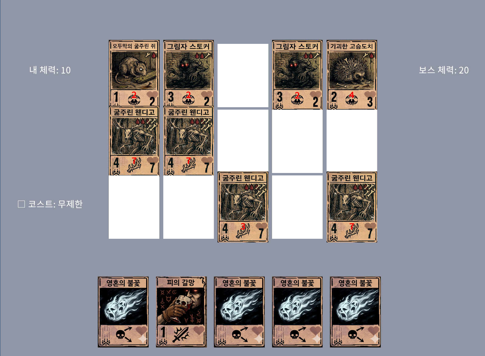

# 로즈마리 · 테스트 케이스와 버그 리포트

2026년 개발해 8월까지 작업한 4인 팀 프로토타입입니다. 카드게임과 덱빌드 요소를 결합한 게임에서 QA를 담당하고 기획·UI 작업에 참여했습니다.

## 맡은 작업

카드 효과, 덱 구성과 대화창의 동작을 확인하고 테스트 케이스를 작성했습니다. 결함을 발견하면 재현 절차와 기대·실제 결과를 PowerPoint 리포트로 정리했습니다. 문서는 팀의 Google Drive QA 폴더에 갱신하고 Discord로 피드백과 변경 사항을 전달했습니다.

## 테스트 케이스 발췌

2026년 7월 21일자 TC에서 두 항목을 발췌했습니다.

| ID | 조건과 절차 | 기대 결과 | 원본 기록 |
| --- | --- | --- | --- |
| TC-GRD-005 | 마법 카드가 포함된 덱으로 플레이하며 행·열 효과와 적 피해를 확인 | 카드 효과가 정해진 대로 적용되고, 마법 카드는 그리드에 배치되지 않음 | FAIL. 빠르게 사용하면 빈 칸에 마법 카드가 배치됨 |
| TC-DEK-003 | 확인할 카드를 저장한 덱으로 플레이하며 턴을 진행 | 저장한 카드가 모두 플레이어 덱에 포함됨 | PASS. 실제 결과의 상세 설명은 원본에 없음 |

## 카드 효과 연계 결함

**BUG-2026-004 · 2026.07.14 · PC · 원본 상태 Open**

‘피의 갈망’의 추가 피해 효과가 ‘영혼의 불꽃’과 연계되는지 확인했습니다. 체력 7인 ‘굶주린 웬디고’를 공격한 뒤 남은 체력을 비교했습니다.

1. 두 카드가 포함된 덱으로 테스트합니다.
2. 피의 갈망을 적용한 뒤 영혼의 불꽃으로 웬디고를 공격합니다.
3. 공격 전후 체력과 카드 설명의 피해량을 비교합니다.

| 비교 항목 | 기대 결과 | 실제 결과 |
| --- | --- | --- |
| 피해량 | 기본 4 + 추가 2 = 6 | 공격 전 체력 7 − 남은 체력 3 = 4 |
| 남은 체력 | 1 | 3 |

카드 설명을 기준으로 기대 피해량을 계산하고, 실제 체력 변화와의 차이를 리포트로 전달했습니다. 이 리포트의 수정 완료 및 재검증 결과는 확인되지 않아 상태를 Open으로 유지했습니다.

## 협업에서 활용한 방식

TC와 리포트를 공용 QA 폴더에 모아 개발자가 같은 자료를 확인할 수 있도록 했습니다. 팀 회의록에는 개발자가 리포트를 바탕으로 수정하는 업무도 남아 있습니다. 개별 결함의 해결 여부는 해당 항목의 기록으로 판단했습니다.

**자료:** 당시 TC Excel, 버그 리포트 PowerPoint, 팀 업무 기록. 위 표는 원본의 의미를 유지해 읽기 쉽게 정리한 발췌본입니다.

[포트폴리오 홈](../README.md)
